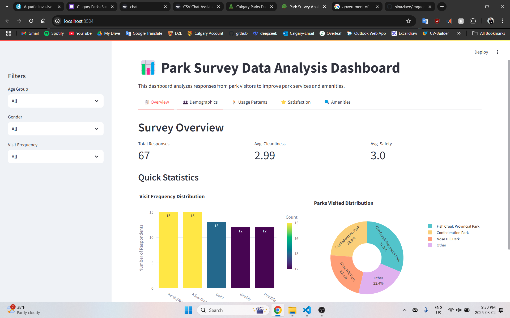

# AI-Powered Public Engagement & Analytics Platform

An innovative solution that revolutionizes public engagement in decision-making by transforming tedious surveys into an accessible, voice-powered, and AI-enhanced experience.

---

## Table of Contents

- [Overview](#overview)
- [Problem Statement](#problem-statement)
- [Our Solution](#our-solution)
- [Key Features](#key-features)
- [Screenshots](#screenshots)
- [Technologies Used](#technologies-used)
- [Installation & Usage](#installation--usage)
- [Future Enhancements](#future-enhancements)
- [License](#license)

---

## Overview

In many cities, public engagement and feedback collection are crucial to drive data-driven improvements. However, traditional survey methods often lead to low participation, survey fatigue, and difficulties for users with disabilities or limited digital literacy. Our project aims to tackle these challenges with a state-of-the-art platform that harnesses AI and voice technologies to streamline survey participation and extract actionable insights from public data.

---

## Problem Statement

Public engagement in decision-making processes is often hindered by tedious survey methods, low participation rates, and accessibility barriers. Traditional surveys require users to manually fill out lengthy forms, leading to survey fatigue and disengagement. Many individuals, including those with disabilities or limited digital literacy, struggle to contribute effectively. As a result, valuable insights from the community remain underutilized, limiting data-driven improvements.

Additionally, user-generated reviews on platforms like Google Maps contain rich, unstructured feedback, but cities and organizations lack efficient ways to analyze and extract meaningful insights from this data. For example, Calgary’s parks receive thousands of online reviews, but the city currently has no streamlined method to automate sentiment analysis and use this feedback for park improvements. By failing to leverage modern AI-driven solutions, decision-makers miss critical public opinions, resulting in inefficient planning and resource allocation.

There is a growing need for a more inclusive, engaging, and intelligent feedback system that makes surveys effortless, enhances accessibility, and extracts insights from public data to drive impactful changes.

---

## Our Solution

**Traditional public engagement and survey methods are often tedious, leading to low participation and limited insights.** Our AI-powered survey and analytics platform revolutionizes this process by integrating:

- **Voice-Based Survey Completion:** Users can complete surveys by speaking, eliminating the need to fill out lengthy forms.
- **AI-Driven Chatbot Assistance:** An intelligent chatbot guides users through the survey process and provides real-time answers based on public feedback.
- **Data Analytics & Visualization:** Extracts and processes unstructured data (e.g., scraped Google Maps reviews) to provide valuable insights for city planners, businesses, and researchers.

This combination of automated voice surveys, AI chat interaction, and advanced analytics transforms raw public feedback into actionable intelligence, ultimately enhancing public engagement and supporting data-driven decision-making.

---

## Key Features

- **Voice-Activated Surveys:** Makes participation more natural and accessible, reducing survey fatigue.
- **Chatbot Assistance:** Offers real-time support and feedback, ensuring users feel engaged and understood.
- **Sentiment Analysis:** Leverages AI to extract meaningful insights from large volumes of user-generated reviews.
- **Data Visualization:** Provides advanced analytics and visualization tools to help decision-makers interpret feedback effectively.
- **Accessibility:** Designed with inclusive interfaces to cater to users with varying digital skills and disabilities.

---

## Screenshots

Below are some screenshots from the project showcasing the user interface and data visualization components:




*Note: Replace the file paths with the actual paths where the images are stored in your repository.*

---

## Technologies Used

- **Voice Recognition:** For natural language survey responses.
- **Natural Language Processing (NLP):** For sentiment analysis and chatbot functionality.
- **Data Analytics Tools:** For processing and visualizing the feedback data.
- **Web Scraping:** To extract public reviews from platforms like Google Maps.

---

## Installation & Usage

1. **Clone the Repository:**
   ```bash
   git clone https://github.com/yourusername/yourproject.git
